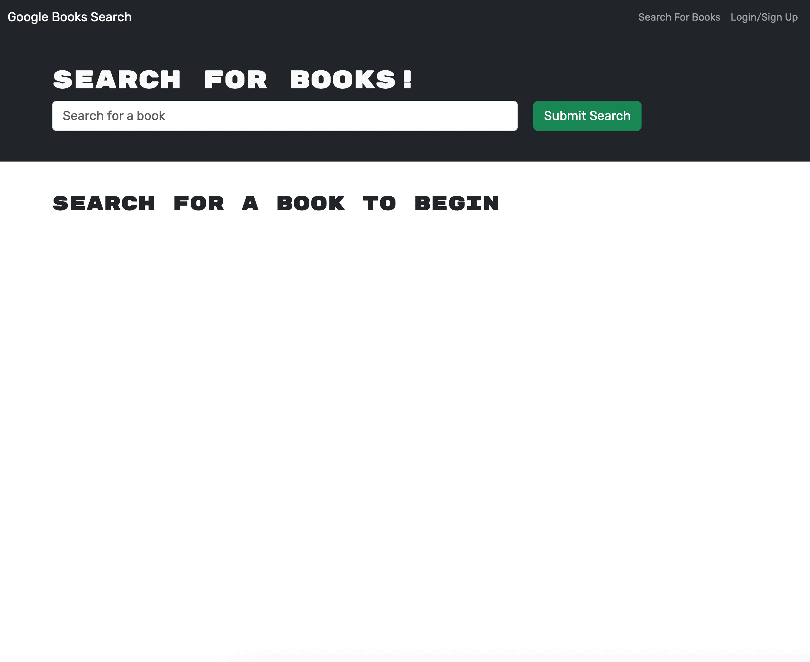
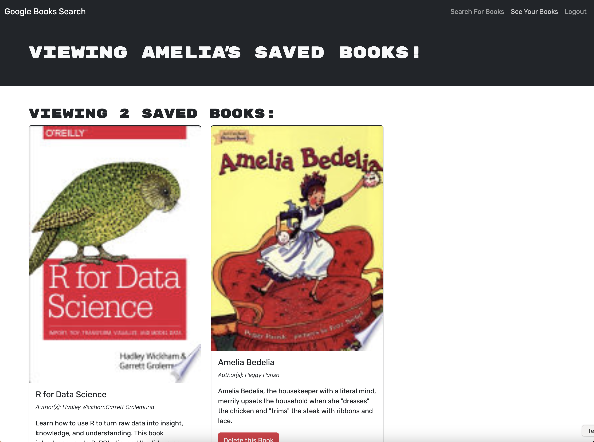

# GraphQL Book Search

## Description

This application leverages the Google Books API to provide users with a powerful book search engine. Users can explore books without creating an account, or they can register and log in to save books to their personalized "Saved Books" list. This project involved refactoring a RESTful API into a GraphQL API and was developed using the MERN stack. Unlike my previous projects, this application utilizes MongoDB Atlas for the database. Through this project, I enhanced my development skills with GraphQL APIs by implementing Apollo Server and Apollo Provider, deepened my understanding of database management, and successfully integrated authentication features to enable user account creation and secure login functionality.

## Table of Contents

- [Link to Application](#link-to-application)
- [Installation](#installation)
- [Usage](#usage)
- [Credits](#credits)
- [License](#license)
- [Questions](#questions)

## Link to Application

https://graphql-book-search-bucy.onrender.com

## Installation

Installation is not required to use this application. You can access it by using the link above. If you want to install the repo on your local device, perform the following steps:

1. Open your terminal and navigate to the directory where you want to store the repository.

2. Clone the repository to your local machine with the following command:

   ```sh
   git clone https://github.com/amelia1105/graphql-book-search.git
   ```

3. Navigate into the graphql-book-search directory:

   ```sh
   cd graphql-book-search
   ```

4. Install the necessary dependencies by running:

   ```sh
   npm install
   ```

## Usage

### If you used the link to the deployed application...

1. Access the application using the link provided above. This will take you to the homepage.

   

2. Enter the name of a book in the search bar and press "Enter" or click "Submit Search". The search results will appear below.

3. To save books, create an account by clicking "Login/Signup" in the top-right corner. Navigate to "Sign Up" and fill in your details. You will be logged in automatically after registration.

4. Save books to your "Saved Books" list by clicking "Save this Book" on any search result.

5. View your saved books by clicking "See Your Books" at the top. You can remove books from this list by clicking "Delete this Book".

   

### If you cloned the repo to your device...

If you have cloned the repository to your local machine for testing, ensure you have a method to connect to a MongoDB database, such as MongoDB Compass.

1. Locate the `.env.EXAMPLE` files in both the client and server directories. Rename these files to `.env`. In the server `.env` file, set your JWT secret key (this can be any string). The MongoDB connection was set up using the default connection string. Ensure the `MONGODB_URI` matches your MongoDB Compass connection string.

2. Navigate to the `graphql-book-search` directory and build the application by running:

   ```sh
   npm run build
   ```

3. Start the development server to view the application locally by running:

   ```sh
   npm run develop
   ```

4. The application should automatically open in your browser. If it doesn't, check the console for the local URL (http://localhost:3000/). Additionally, GraphQL will be available at http://localhost:3001/graphql, where you can test API requests. Follow the steps above to explore the application.

## Credits

Starter code for this application was provided through the Rutgers University Coding Bootcamp (Module 18 Challenge). The original code featured a functional program utilizing a RESTful API. As part of the refactoring process, I made significant updates to both the server and client sides to implement a GraphQL API.

### Server-Side Updates

- Modified `auth.ts` and `server.ts` to support GraphQL functionality.
- Added a new `schemas` folder containing the necessary type definitions and resolvers for the GraphQL API.

### Client-Side Updates

- Created `queries.ts` and `mutations.ts` to handle GraphQL queries and mutations.
- Updated key components, including `App.tsx`, `SearchBooks.tsx`, `SavedBooks.tsx`, `SignupForm.tsx`, and `LoginForm.tsx`, to integrate GraphQL operations.
- Added `.env` and `vite-env.d.ts` files to manage environment variables and TypeScript configurations.

Throughout the development process, I utilized GitHub Copilot and ChatGPT for assistance with debugging and implementing complex features.

## License

MIT License

Copyright (c) 2025 Amelia Alvarado

Permission is hereby granted, free of charge, to any person obtaining a copy
of this software and associated documentation files (the "Software"), to deal
in the Software without restriction, including without limitation the rights
to use, copy, modify, merge, publish, distribute, sublicense, and/or sell
copies of the Software, and to permit persons to whom the Software is
furnished to do so, subject to the following conditions:

The above copyright notice and this permission notice shall be included in all
copies or substantial portions of the Software.

THE SOFTWARE IS PROVIDED "AS IS", WITHOUT WARRANTY OF ANY KIND, EXPRESS OR
IMPLIED, INCLUDING BUT NOT LIMITED TO THE WARRANTIES OF MERCHANTABILITY,
FITNESS FOR A PARTICULAR PURPOSE AND NONINFRINGEMENT. IN NO EVENT SHALL THE
AUTHORS OR COPYRIGHT HOLDERS BE LIABLE FOR ANY CLAIM, DAMAGES OR OTHER
LIABILITY, WHETHER IN AN ACTION OF CONTRACT, TORT OR OTHERWISE, ARISING FROM,
OUT OF OR IN CONNECTION WITH THE SOFTWARE OR THE USE OR OTHER DEALINGS IN THE
SOFTWARE.

## Questions

For any questions about this project, please contact me by email: ameliabalvarado@gmail.com
